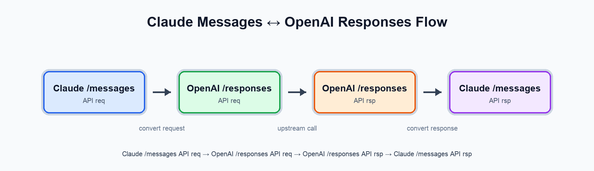

# claude-code-transformer

`claude-code-transformer` 是一个用 Go/Gin 实现的协议适配服务。它在本地暴露 Anthropic Messages 兼容接口，并将请求转换后转发到上游 OpenAI-compatible Responses API，使依赖 Anthropic/Claude 协议的客户端可以复用支持 Responses API 的模型网关。

## 功能特性

- 兼容 Anthropic Messages API 的核心路由：`/anthropic/v1/messages`。
- 支持流式和非流式响应转换。
- 将 Claude 消息、系统提示、工具调用、工具结果、图片、thinking/reasoning 等内容转换为 OpenAI Responses API 请求。
- 将 Responses API 或 Chat Completions 风格的上游响应转换回 Anthropic message/content block 结构。
- 支持 `web_search` 内置工具映射、函数工具映射、reasoning summary、encrypted reasoning content 和 usage 统计归一化。
- 支持通过 query/header/Authorization 传入上游 API Key。
- 提供 `/messages/count_tokens` 的轻量 token 估算接口。
- 内置 CORS、认证、通用日志、panic recovery 中间件。
- 基于 logrus + lumberjack 输出控制台和滚动文件日志。

## 工作机制

服务的主要数据流如下：



核心实现位置：

| 模块 | 说明 |
| --- | --- |
| `main.go` | 读取配置、初始化日志、创建 Gin engine 并启动 HTTP 服务。 |
| `src/router/router.go` | 规范化 `base_path`，注册 Anthropic 兼容路由。 |
| `src/middleware/auth.go` | 从 `ak`、`api-key`、`x-api-key`、`Authorization` 等位置提取上游 API Key。 |
| `src/handler/claude-messages.go` | 处理 `/messages` 请求，解析 Anthropic body，转换并转发到上游 Responses API。 |
| `src/handler/count_tokens.go` | 实现 `/messages/count_tokens` 的近似 token 计数。 |
| `src/claude/conversion/request_converter.go` | 将 Claude 请求转换为 OpenAI Responses 请求。 |
| `src/claude/conversion/response_converter.go` | 将上游响应和 SSE 事件转换为 Anthropic 响应格式。 |
| `src/openai/client.go` | OpenAI-compatible HTTP/SSE 客户端，负责请求上游和错误映射。 |
| `src/config/log.go` | stdout + 文件日志多路输出和日志滚动。 |

## API 路由

默认配置中 `base_path` 为 ``，服务端口为 `7777`，因此默认路由为：

| 方法 | 路由 | 说明 |
| --- | --- | --- |
| `POST` | `/anthropic/v1/messages` | Anthropic Messages 兼容接口。 |
| `POST` | `/anthropic/v1/messages/count_tokens` | Anthropic count_tokens 兼容接口，使用字符数近似估算。 |

如果修改 `conf/config.yaml` 中的 `base_path`，实际路由会随之变化。

## 环境要求

- Go 1.18+
- 一个兼容 OpenAI Responses API 的上游服务
- 可用于访问上游服务的 API Key

## 配置

默认配置文件位于 `conf/config.yaml`：

```yaml
server_port: 7777
server_addr: "0.0.0.0"
base_path: ""

openai_base_url: "https://your-openai-compatible-upstream.example.com"

log:
  filename: "./logs/server.log"
  max_size: 100
  max_backups: 10
  max_age: 7
  compress: true
  level: "info"
```

关键配置项：

| 配置项 | 说明 |
| --- | --- |
| `server_addr` | HTTP 服务监听地址。 |
| `server_port` | HTTP 服务监听端口。 |
| `base_path` | API 路由前缀，支持为空或带 `/` 的路径。 |
| `openai_base_url` | 上游 OpenAI-compatible 服务地址；代码会请求 `{openai_base_url}/responses`。 |
| `log` | 日志文件、保留策略和日志级别配置。 |

开源使用时请将 `openai_base_url` 替换为你自己的上游网关地址，不要提交内部地址或密钥。

## 快速开始

### 1. 克隆并进入项目

```bash
git clone <your-repo-url>
cd claude-code-transformer
```

### 2. 安装依赖

```bash
go mod download
```

### 3. 修改配置

编辑 `conf/config.yaml`，至少确认：

- `openai_base_url` 指向可访问的 OpenAI-compatible Responses API 上游。
- `server_addr`、`server_port`、`base_path` 符合本地或部署环境要求。
- 日志目录有写入权限。

### 4. 启动服务

```bash
go run main.go -conf ./conf/config.yaml
```

默认启动后监听：

```text
0.0.0.0:7777
```

## 请求示例

### 非流式 Messages 请求

```bash
curl -X POST "http://localhost:7777/anthropic/v1/messages" \
  -H "Content-Type: application/json" \
  -H "Authorization: Bearer ${UPSTREAM_API_KEY}" \
  -d '{
    "model": "gpt-4.1",
    "max_tokens": 1024,
    "messages": [
      {
        "role": "user",
        "content": "Hello, introduce yourself briefly."
      }
    ]
  }'
```

### 流式 Messages 请求

```bash
curl -N -X POST "http://localhost:7777/anthropic/v1/messages" \
  -H "Content-Type: application/json" \
  -H "Authorization: Bearer ${UPSTREAM_API_KEY}" \
  -d '{
    "model": "gpt-4.1",
    "max_tokens": 1024,
    "stream": true,
    "messages": [
      {
        "role": "user",
        "content": "Write a short haiku about distributed systems."
      }
    ]
  }'
```

### Token 估算请求

```bash
curl -X POST "http://localhost:7777/anthropic/v1/messages/count_tokens" \
  -H "Content-Type: application/json" \
  -H "Authorization: Bearer ${UPSTREAM_API_KEY}" \
  -d '{
    "model": "gpt-4.1",
    "messages": [
      {
        "role": "user",
        "content": "Count these tokens approximately."
      }
    ]
  }'
```

## 认证方式

服务会从以下位置提取 API Key，并将其用于请求上游服务：

1. query 参数：`?ak=...`
2. header：`api-key`、`API-KEY`、`x-api-key`、`X-API-Key`
3. header：`Authorization: Bearer ...`
4. header：`Authorization: ...`

推荐在生产环境使用 `Authorization: Bearer ...` 或 `x-api-key`，并通过 HTTPS 部署服务。

## 自定义请求参数

`/messages` 支持通过 `X-Custom-Json-Params` header 传入 JSON 对象，在转发上游前覆盖部分输出配置。该 header 会在转发前被移除，不会透传给上游。

支持字段：

| 字段 | 类型 | 说明 |
| --- | --- | --- |
| `effort` / `reasoning_effort` | string | 覆盖 reasoning effort。 |
| `summary` / `reasoning_summary` | string | 覆盖 reasoning summary。 |
| `force_streaming` | bool/string/number | 强制启用流式模式。 |
| `text_verbosity` / `verbosity` | string | 覆盖 Responses API text verbosity。 |
| `include_encrypted_content` | bool/string/number | 控制是否携带 encrypted reasoning content。 |

示例：

```bash
curl -X POST "http://localhost:7777/anthropic/v1/messages" \
  -H "Content-Type: application/json" \
  -H "Authorization: Bearer ${UPSTREAM_API_KEY}" \
  -H 'X-Custom-Json-Params: {"reasoning_effort":"medium","text_verbosity":"low","force_streaming":true}' \
  -d '{
    "model": "gpt-4.1",
    "max_tokens": 1024,
    "messages": [{"role":"user","content":"Explain the request flow."}]
  }'
```

## 开发命令

```bash
# 格式化代码
go fmt ./...

# 静态检查
go vet ./...

# 运行所有测试
go test ./...

# 运行单个包测试
go test ./src/claude/conversion

# 构建所有包
go build ./...
```

## 测试

项目使用 Go 标准测试框架和 `stretchr/testify`。测试文件覆盖了请求/响应转换、OpenAI 客户端、日志配置和 formatter 等模块。

常用命令：

```bash
go test ./...
go test ./src/openai -run TestName
go test ./src/claude/conversion -run TestName
```

## 项目结构

```text
.
├── conf/
│   └── config.yaml              # 默认运行配置
├── main.go                      # 程序入口
├── src/
│   ├── claude/
│   │   ├── conversion/          # Claude 与 OpenAI Responses 互转逻辑
│   │   ├── model/               # Anthropic/Claude 请求模型
│   │   └── constants/           # 协议常量
│   ├── config/                  # 配置加载和日志 writer
│   ├── formatter/               # logrus formatter
│   ├── handler/                 # HTTP handler
│   ├── middleware/              # Gin middleware
│   ├── openai/                  # 上游 OpenAI-compatible client
│   ├── router/                  # 路由注册
│   └── utils/                   # 通用工具
├── go.mod
└── go.sum
```
